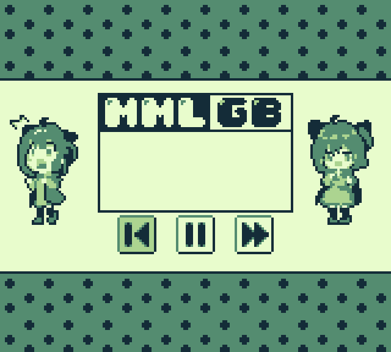

mmlgb
=====

A MML parser and GBDK sound driver for the Nintendo Game Boy.

Please refer to the [MMLGB Wiki](https://github.com/potatoTeto/mmlgb/wiki) for additional information regarding usage.

## Dependencies
- [GBDK](https://github.com/gbdk-2020/gbdk-2020)
  - ``gbdk/bin`` should also be added to PATH/Environment Variables.

- [.NET SDK (C#)](https://dotnet.microsoft.com/download)
  - Required to build the cross-platform C# parser (`MMLGB.dll`).
  - You must have the `dotnet` CLI available in your terminal (`dotnet --version` to check).

- [Python 3.x](https://www.python.org/downloads/)  
  - Only required if you use helper scripts or additional processing tools that depend on Python.

# Usage
- Create or place your .mml file directly in the ``music/`` directory.
  - Feel free to check out the included examples for studying purposes!)
- Execute ``compile[.bat/.sh] your_file.mml`` in Terminal/Command Prompt to compile ``rom.gb``. Feel free to amend ``start rom.gb`` at the bottom of the ``compile`` script to auto-launch ``rom.gb`` in your favorite emulator.
  - For accuracy reasons, I highly recommend the [bgb emulator](https://bgb.bircd.org/).

# Build Distribution
- Launch dist.bat/dist.sh, depending on your OS.
- The distributable file will be in the ``dist`` directory, as a timestamped .zip

### Special Thanks
- @SimonLarsen, Original developer - [mmlgb v1.0](https://github.com/SimonLarsen/mmlgb)
- @jimmy-dsi, Programming assistance - [GitHub](https://github.com/jimmy-dsi)
- @untoxa, Adapting the code for GBDK-2020 v4.x + Clean refactor - [GitHub](https://github.com/untoxa)

## License

mmlgb Source Code - MIT

All demo songs & art - CC BY-NC 4.0
